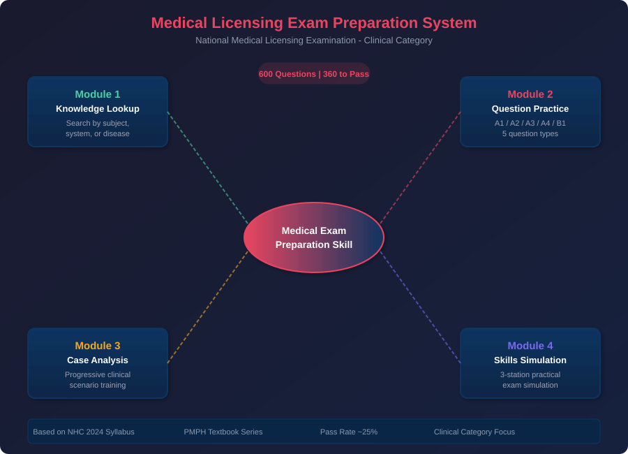
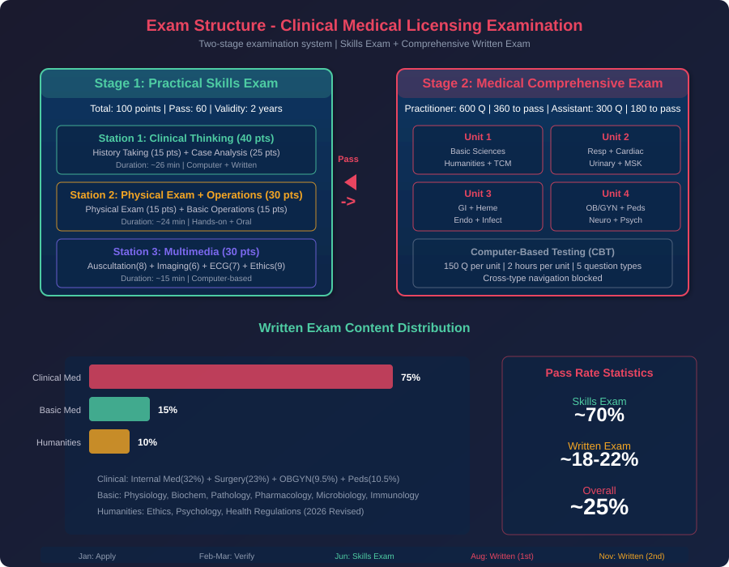
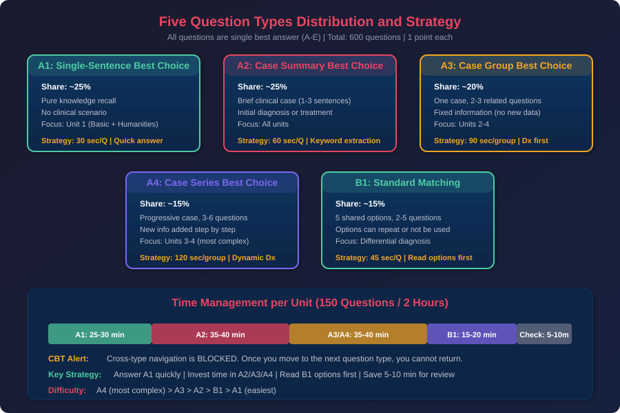
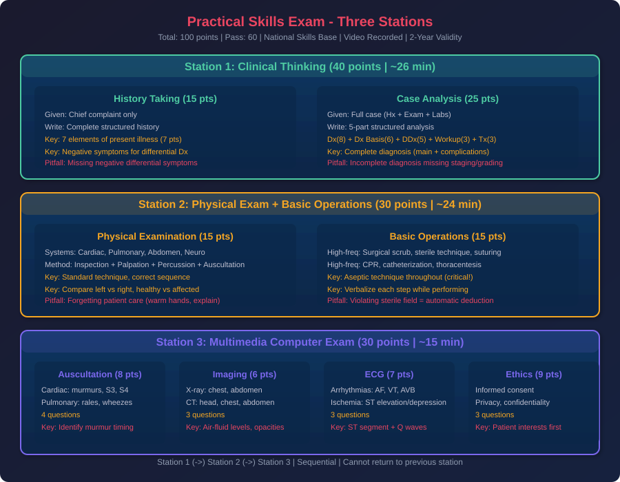
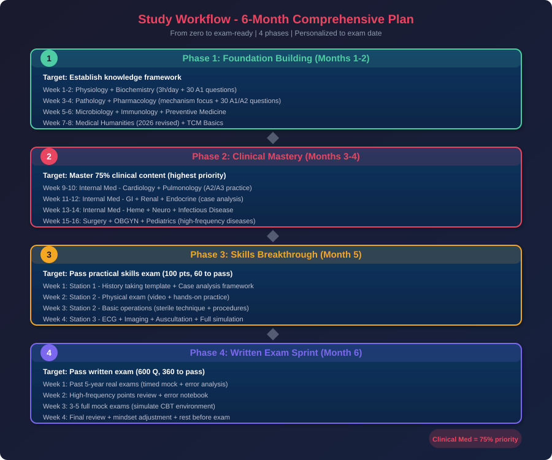
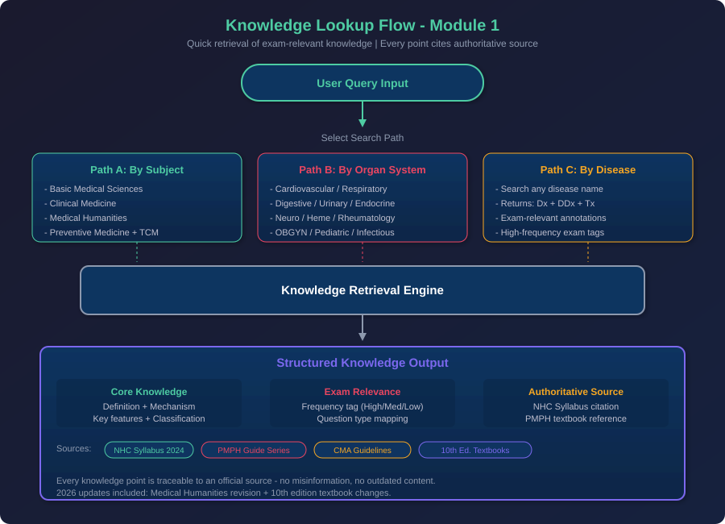
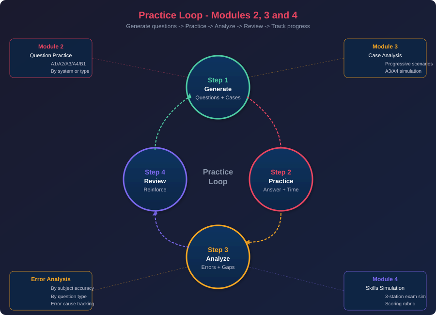

# Medical Licensing Exam Preparation Skill | 医考通关

> 🏥 **权威医考备考技能** — 帮助中国临床医学生通过国家医师资格考试的完整备考系统

[](https://opensource.org/licenses/MIT)
[]()
[](https://www.nmec.org.cn)
[]()
[]()
[]()

---

## 📋 项目简介

本项目是一套面向中国临床医学专业学生的**医师资格考试备考技能（Skill）**，基于国家卫健委《医师资格考试大纲（2024年版）》及《医学综合考试医学人文部分（2026年修订版）》编写，覆盖临床执业医师和执业助理医师的**实践技能考试**与**医学综合笔试**全流程。

全国医师资格考试综合通过率仅约25%，笔试通过率更低至18-22%。本技能针对这一痛点，提供"**可查可练**"的四大核心功能模块，帮助考生系统备考、高效通关。

### 🎯 核心特色

- ✅ **权威溯源**：每个考点标注官方大纲条款和教材依据
- ✅ **双阶覆盖**：实践技能 + 医学综合笔试全覆盖
- ✅ **五大题型**：A1/A2/A3/A4/B1 全题型练习
- ✅ **渐进病例**：模拟A3/A4型渐进式临床决策训练
- ✅ **技能模拟**：三站式实践技能考试全真模拟
- ✅ **个性化计划**：根据考试日期和薄弱环节生成备考计划

---

## 📊 考试数据一览

| 项目 | 执业医师 | 助理医师 |
|------|----------|----------|
| 笔试题量 | 600题（4单元×150题） | 300题（2单元×150题） |
| 笔试合格线 | 360分 | 180分 |
| 考试形式 | 计算机化考试(CBT) | 计算机化考试(CBT) |
| 题型 | A1/A2/A3/A4/B1 | A1/A2/A3/A4/B1 |
| 技能考试 | 100分/60分合格/2年有效 | 同左 |
| 综合通过率 | ~25% | ~25% |

---

## 🔧 四大核心功能

### 模块一：考点速查（Knowledge Lookup）
- 按学科/系统/疾病三维检索
- 每个考点关联临床指南和教材依据
- 高频/中频/低频出题频率标注
- 2026年新增考点特别标记

### 模块二：题型专项练习（Question Practice）
- A1型题（单句记忆）— 基础概念快速检索
- A2型题（病例摘要）— 临床诊断入门训练
- A3型题（病例组型）— 多角度诊疗思维
- A4型题（病例串型）— 渐进式临床决策
- B1型题（配伍选择）— 鉴别诊断对比记忆
- 每题含详细解析、考点映射、易错分析

### 模块三：病例分析训练（Case Analysis Training）
- 渐进式临床场景模拟
- 病情逐步展开，动态决策训练
- 覆盖内科/外科/妇产/儿科高频疾病
- 配合技能考试病例分析评分标准

### 模块四：技能实操模拟（Skills Simulation）
- 第一站模拟：病史采集（15分模板）+ 病例分析（25分框架）
- 第二站模拟：体格检查清单 + 基本操作评分标准
- 第三站模拟：心电图/影像/听诊/医德医风

---

## 📁 文件结构

```
medical-exam-prep/
├── SKILL.md                              # 技能主文件（功能说明+使用指南）
├── references/                           # 参考文档
│   ├── exam-system-overview.md           # 医考制度总览
│   ├── exam-syllabus-clinical.md         # 临床类别考试大纲详解
│   ├── question-types-guide.md           # 五大题型解题指南
│   ├── clinical-skills-stations.md       # 实践技能三站详解
│   ├── high-frequency-points.md          # 高频考点速查
│   ├── disease-knowledge-base.md         # 疾病知识库
│   ├── study-plan-templates.md           # 备考计划模板
│   └── exam-tips-strategies.md           # 应试策略与技巧
├── templates/                            # 生成模板
│   ├── a1-question-template.md           # A1题型生成模板
│   ├── a2-question-template.md           # A2题型生成模板
│   ├── a3-a4-question-template.md        # A3/A4题型生成模板
│   ├── b1-question-template.md           # B1题型生成模板
│   ├── case-analysis-template.md         # 病例分析模板
│   ├── history-taking-template.md        # 病史采集模板
│   ├── physical-exam-checklist.md        # 体格检查清单
│   └── mock-exam-template.md             # 模拟试卷模板
├── examples/                             # 示例
│   ├── sample-a2-question.md             # A2题型示例
│   ├── sample-a3-a4-case.md              # A3/A4病例示例
│   ├── sample-case-analysis.md           # 病例分析示例
│   └── sample-history-taking.md          # 病史采集示例
├── docs/
│   └── images/                           # 流程图（7张SVG）
│       ├── system-overview-en.svg        # 系统总览
│       ├── exam-structure-en.svg         # 考试结构
│       ├── question-types-en.svg         # 题型分布
│       ├── skills-stations-en.svg        # 技能考试
│       ├── study-workflow-en.svg         # 备考工作流
│       ├── knowledge-query-en.svg        # 考点速查
│       └── practice-loop-en.svg          # 练习闭环
├── README.md                             # 中文介绍（本文件）
├── README_EN.md                          # 英文介绍
├── LICENSE                               # MIT许可证
└── CITATION.cff                          # 引用信息
```

---

## 📈 流程图预览

### 系统总览


### 考试结构


### 题型分布


### 技能考试三站


### 备考工作流


### 考点速查


### 练习闭环


---

## 🚀 使用方法

### 考点速查
```
"查一下急性心肌梗死的考点"
"心血管系统有哪些高频考点"
"卫生法规2026年新增了哪些内容"
```

### 题型练习
```
"给我出5道A2型题，关于消化系统"
"出一组A3/A4病例题，关于肺炎"
"出10道B1配伍题，关于药理学"
"生成一套模拟试卷，临床执业医师第一单元"
```

### 病例分析训练
```
"生成一个急性阑尾炎的病例分析"
"出一个渐进式病例，从胸痛到确诊"
"训练一个儿科发热病例的分析"
```

### 技能实操模拟
```
"模拟第一站病史采集，主诉：腹痛3天"
"模拟体格检查，心脏听诊"
"模拟第三站心电图判读"
```

---

## 📚 权威来源

所有内容基于以下权威资料：

1. 《医师资格考试大纲（2024年版）》— 国家卫生健康委员会
2. 《医师资格考试医学综合考试医学人文部分（2026年修订版）》
3. 《医师资格考试系列指导用书》— 人民卫生出版社（20种）
4. 《临床诊疗指南》— 中华医学会
5. 人卫第10版全国医学教材
6. 国家医学考试网（nmec.org.cn）官方政策文件

---

## ⚠️ 使用须知

- 本技能为学习辅助工具，不替代系统医学教育
- 练习题为AI生成的训练题，请以官方题库为准
- 医学知识更新迅速，请核实最新指南
- 实践技能需实际操作训练，模拟仅为辅助

---

## 📄 许可证

本项目采用 [MIT License](LICENSE) 开源协议。

---

## 🔗 相关链接

- [国家医学考试网](https://www.nmec.org.cn)
- [国家卫生健康委员会](http://www.nhc.gov.cn)
- [人民卫生出版社](http://www.pmph.com)

---

## 📝 引用

如果您在研究或项目中使用了本技能，请按 [CITATION.cff](CITATION.cff) 引用。

---

*基于 OpenClaw Skill 框架开发 | Based on OpenClaw Skill Framework*
